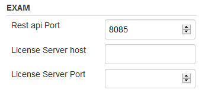
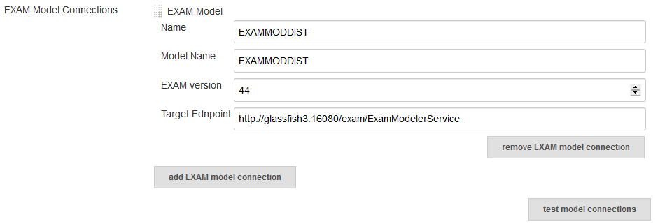
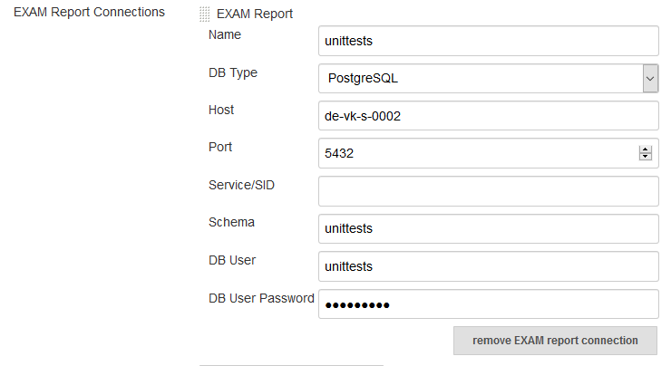
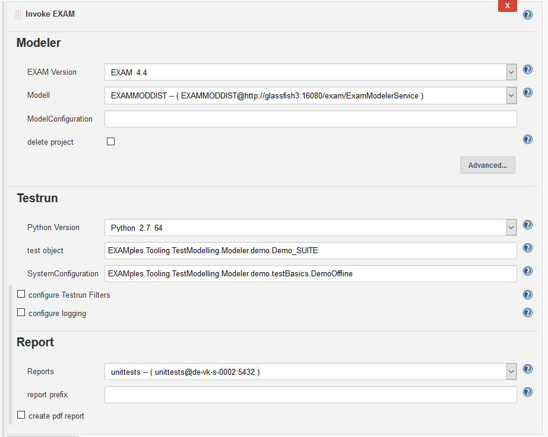
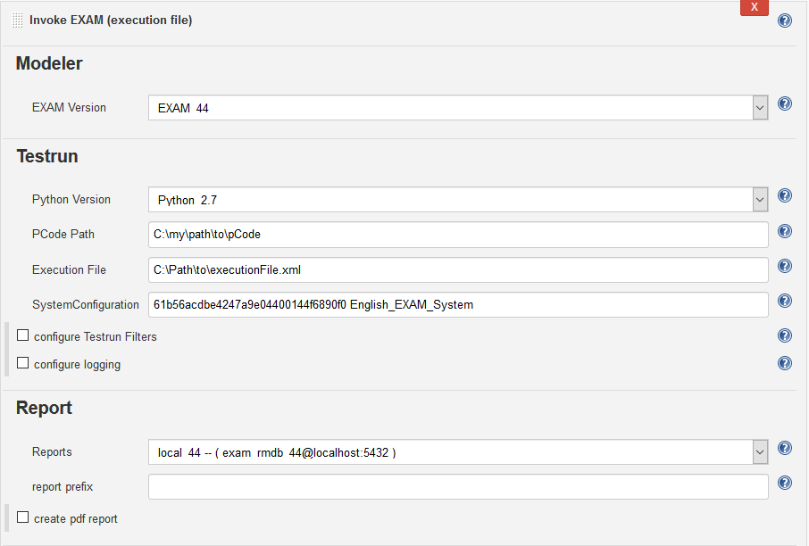

  
This plugin integrates the RESTapi of the Testautomation tool EXAM for
automated test execution. MicroNova EXAM Plugin is available for
download at: 

[exam-testautomation](https://www.micronova.de/testing/exam-testautomation.html)  

  

EXAM is a graphical test development tool. EXAM defines a comprehensive
methodology based on UML to represent, implement and evaluate test
cases. It enables you to graphically model test processes in sequence
diagrams without programming knowledge. EXAM thus provides a uniform
language for the representation of test events. EXAM is suitable for use
in Hardware-in-the-Loop simulation (HiL), test bench automation and
industrial automation as well as in embedded development and
Software-in-the-Loop simulation (SiL).

# Table of contents
- [Requirements](#requirements)
- [Configuration](#configuration)
    * [Global Tool Configuration](#global-tool-configuration)
    * [System Configuration](#system-configuration)
    * [Job Configuration](#job-configuration)

# Requirements

- EXAM  
    - EXAM 4.8
    - RESTapi Plugin for EXAM

- Jenkins-Plugins
    - shiningpanda
    - workflow-step-api

# Configuration

## Global Tool Configuration

For this plugin to be used, an Ant installation must be specified in the
global Jenkins configuration

  

## System Configuration

| general | |
| ------------------- | ------------------------------- |
| Rest api Port       | Port for the communication with the EXAM RESTapi |
| License Server Host | host name of the license server |
| License Server Port | port name of the license server |

| EXAM Model Connection | |
| --- | --- |
| Name            | Identifier of this connection, which can be selected at the build step |
| Model Name      | Name of the model known at the EXAM application server
| EXAM version    | The major and minor version number of EXAM |
| Target Endpoint | url of the EXAM application server |

| EXAM Report Connection | |
| --- | --- |
| Name        | Identifier of this connection, which can be selected at the build step |
| DB Type     | Supported types are Oracle and PostgreSQL |
| Service/SID |Only needed, when Oracle is choosen as DB Type. |

## Job Configuration

The EXAM plugin provides 3 build steps.

1.  Clear EXAM target (use this to clear all junit formated reports
    bevor invoking an EXAM test)  
    
    
      
2.  Invoke EXAM model (invoke an EXAM test with a connection to a EXAM
    model)
    
    | Modeler | |
    | --- | --- |
    | EXAM Version | Choose a configured EXAM installation. |
    | Model | Choose a configured Model Connection. |
    | ModelConfiguration | The UUID of the ModelConfiguration, if the used EXAM Version is 4.6 or newer with active versioning |
    | delete project | If selected, the synchronized python code of the choosen model will be deleted at the beginning. |

    | Testrun | |
    | --- | --- |
    | Python Version | Choose a configured Python installation. |
    | test object | Use the UUID, ID or full scoped name of a TestSuite or TestCampaign from the EXAM model. |
    | SystemConfiguration | Use the UUID, ID or full scoped name of the system configuration from the EXAM model. |
    | configure Testrun Filters | Define filter constraints for the given attribute names. |
    | configure logging | A log file is generated automatically during each test run. You can influence the amount of output that gets logged over the LogLevel. |
  
    | Report | |
    | --- | --- |
    | Reports | Choose a configured Report Connection. If you choose "NO REPORT", no report will be written to a database. Conversion of EXAM Reports to junit report format will be done in any case. |
    | report prefix | Sets a prefix on the report name. |
    | create pdf report | If selected, the report will be exported to a pdf document. |
    
    
    
3.  Invoke EXAM execution file (invoke an EXAM test with an exported
    execution file)  
    
    | Modeler | |
    | --- | --- |
    | EXAM Version | Choose a configured EXAM installation. |

    | Testrun | |
    | --- | --- |
    | Python Version | Choose a configured Python installation. |
    | PCode Path | Path to pCode directory containing the generated code required by the execution file. |
    | Execution File | Path to the EXAM execution file exported from TestRunner. |
    | SystemConfiguration | Sets the default system configuration. For EXAM, use the UUID and the name of the system configuration from the EXAM model, e.g. "61b56acdbe4247a9e04400144f6890f0 English_EXAM_System" |
    | configure Testrun Filters | Define filter constraints for the given attribute names. |
    | configure logging | A log file is generated automatically during each test run. You can influence the amount of output that gets logged over the LogLevel. |
  
    | Report | |
    | --- | --- |
    | Reports | Choose a configured Report Connection. If you choose "NO REPORT", no report will be written to a database. Conversion of EXAM Reports to junit report format will be done in any case. |
    | report prefix | Sets a prefix on the report name. |
    | create pdf report | If selected, the report will be exported to a pdf document. |

    
  

#### Junit Report format

The EXAM reports are converted to standard junit format. To show the
result at Jenkins add a junit report step with the following expression:

    junit 'target/test-reports/**/*.xml'

## License
[MIT License](./LICENSE.md)

## Changelog

[Changelog](./CHANGELOG.md)
